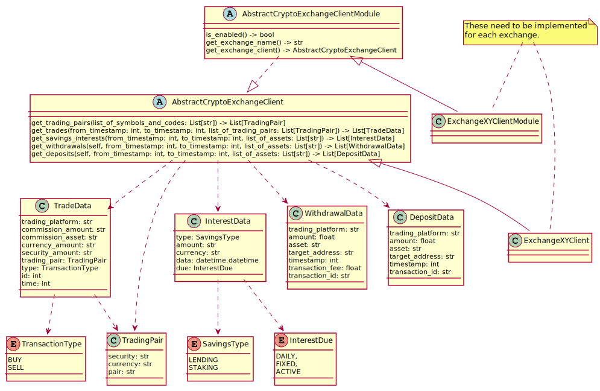

# How to connect to another exchange

So you know the API of your exchange and are interested in extending this service to work with a new exchange which isn't supported by now?
Perfect.

## Overview

[Big Picture](../../plantuml/overview.svg)

## Implementation

To add a new exchange as data source you need to implement two classes which super classes are [declared in here](./exchange_interface.py):
- **AbstractCryptoExchangeClientModule** which is the meta class for your exchange module. It defines meta information and access to the client implementation
  - **is_enabled(self) -> bool**
    - Checks the environmental variables which are needed to run this exchange plugin.
  - **get_exchange_name(self) -> str**
    - Returns the name of the exchange.
  - **get_exchange_client(self) -> AbstractCryptoExchangeClient**
    - Creates and returns an instance of the appropriate AbstractCryptoExchangeClient sub-class.
- **AbstractCryptoExchangeClient** is the specific implementation class for the exchange API which provides
  - **get_trading_pairs(self, list_of_symbols_and_codes: List[str]) -> List[TradingPair]**
    - Checks all eligible products on the exchange and matches them with the list of potential trading-pairs your Firefly-III accounts support.
  - **get_trades(self, from_timestamp: int, to_timestamp: int, list_of_trading_pairs: List[TradingPair]) -> List[TradeData]**
    - Gets and returns all trades of the account (for a given time period).
  - **get_savings_interests(self, from_timestamp: int, to_timestamp: int, list_of_assets: List[str]) -> List[InterestData]**
    - a method to get all received interest (for a given time period)

When you have those classes implemented add your module (*.py file) to [the impl package](./impls). Implementations of AbstractCryptoExchangeClientModule in that package will be picked up automatically during initialization phase of the service.

If you want your exchange implementation added to this repository, just create a pull request with your exchange implementation. When you add the needed environmental variables declared by your exchange plugin the service will automatically connect to that exchange and import data.

Pull requests containing writing actions to the exchange will probably be rejected - as all exchange interactions have to be of read nature.
