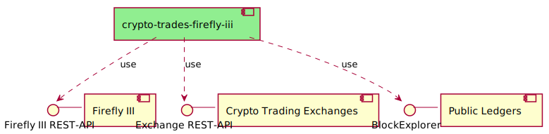

# How to connect to another exchange

So you know the API of your exchange and are interested in extending this service to work with a new exchange which isn't supported by now?
Perfect. There's two classes to extend:
* 

## Overview

[Big Picture](../../plantuml/overview.svg)

## Implementation details

To add a new exchange as data source you need to implement two classes which super classes are [declared in here](./exchange_interface.py):
- **AbstractCryptoExchangeClientModule** which is the meta class for your exchange module. It defines meta information and access to the client implementation
  - the name of the exchange
  - the environmental variables needed to run this exchange plugin
  - an instance of the appropriate CryptoExchangeInterface sub-class
- **AbstractCryptoExchangeClient** is the specific implementation class for the exchange API which provides
  - a method to check connectivity
  - a method to get all trades of the account (for a given time period)
  - a method to get all received interest (for a given time period)
  - a method to get all previously detected trading pairs that were rejected by the exchange

When you have those classes implemented add your module (*.py file) to [the impl package](./impls). Implementations of AbstractCryptoExchangeClientModule in that package will be picked up automatically during initialization phase of the service.

If you want your exchange implementation added to this repository, just create a pull request with your exchange implementation. When you add the needed environmental variables declared by your exchange plugin the service will automatically connect to that exchange and import data.

Pull requests containing writing actions to the exchange will probably be rejected - as all exchange interactions have to be of read nature.
